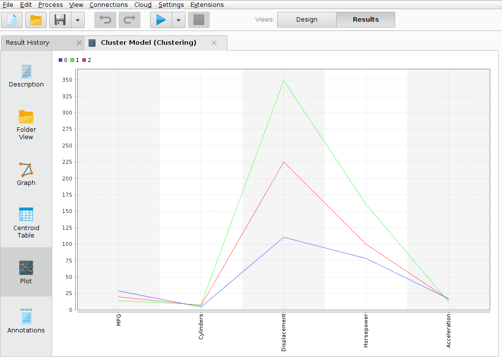

#Resultado 1

#Descripción

En el siguiente modelo se realizara el agrupamiento de los vehiculos con caracteristicas comunes para analizar sus parametros descriptivos (MPG, Cylinders, Displacement, Horsepower, Acceleration). Mediante el uso de los operadores :
	- Normalize: Utilizado para los datos de cada columna de la muestra el operador le restara la media, y el resultado sera dividido entre la variacion estandar. Para que la variables estan medidas en las mismas unidaddes y seran facilmente comparables.
	- K-means: con valores para K = 3 y max runs = 10.

#Gráfico

#Conclusión

Como resultado del modélo usando el operador K-means para el agrupamiento de los vehiculos con caracteristicas comunes, en el gráfico PLOT de coordenadas paralelas  se tiene  a los ejes identificados con las variables (MPG, Cylinders, Displacement, Horsepower, Acceleration ). realizando un análisis sobre  las observaciones del cluster 1 (color verde) tienen un valor bajo en comparación al clusters 0 y 2 en la variable MPG, bajando aun mas el valor de las observaciones hacia el eje de la variable cylinders, seguidamente suben los valores de la observaciones hacia el eje de la variable Displacement, disminuyendo los mismos hacia el eje de la variable Horsepower y Acceleration.

