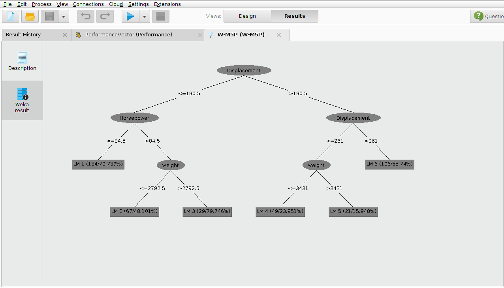
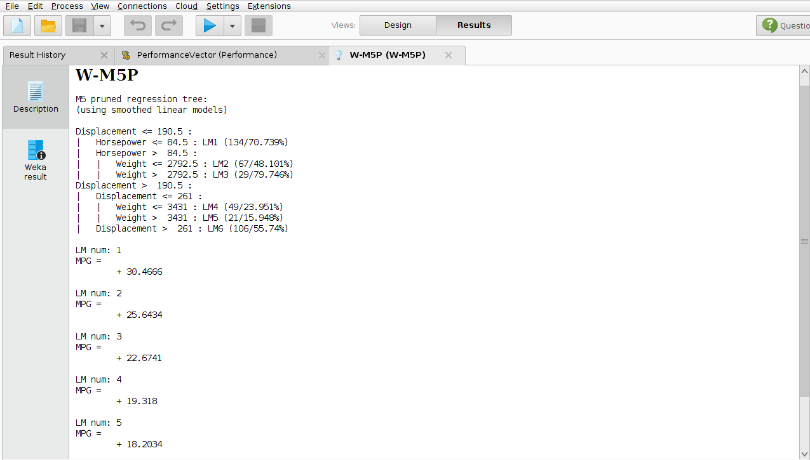

#Resultado 2

#Descripción

En el siguiente modelo mediante  el algoritmo W-M5P, se pretende realizar un análisis para predecir el valor de la variable dependiente continua MPG (millas por galon) a través de un arbol de predicción. Las variables que se usaron explicar el valor  de MPG son : Cylinders,Displacement, Horsepower, Weight.

#Gráfico

#Conclusión

Mediante el arbol de predicción podremos obtener el valor para MPG. En el grafico anterior podemos observarm, si el displacemente es menor o igual a 190.5 y el horsepowe menor o igual a 84.5 entonces el valor de la variable MPG sera de  30.4666.
