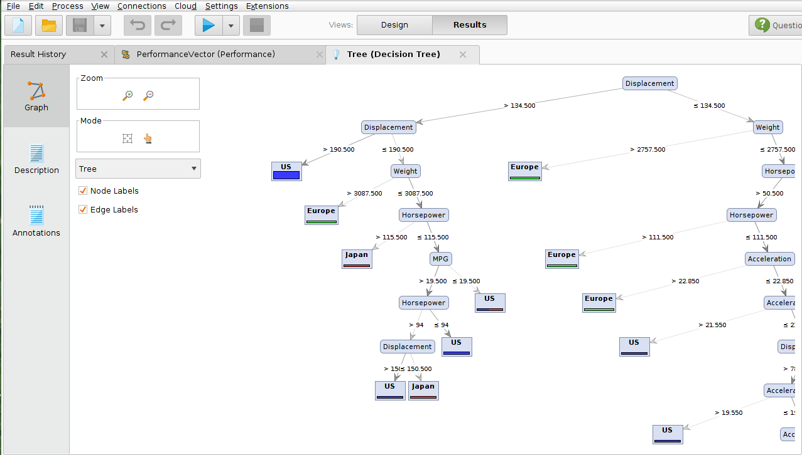
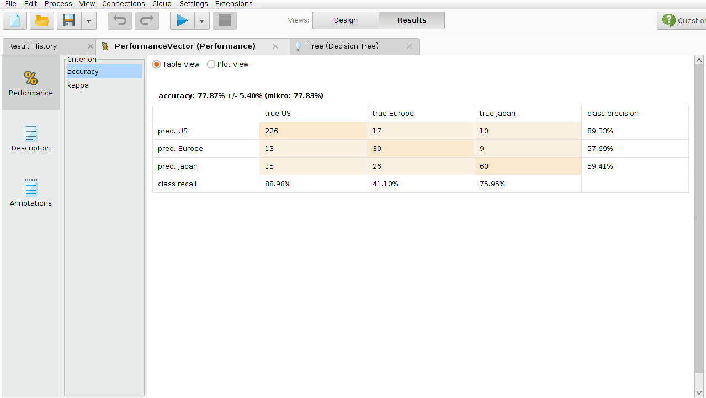

#Resultado 3

#Descripción

En el siguiente modelo  mediante el uso de una Cadena de validacion nominal y el algoritmo de arbol de decision (clasificación),  se  realizara un análisis (de típo pronostico) para determinar el origen al cual corresponde el vehiculo  de acuerdo a los valores definidos en sus variables  Acceleration, Cylinders, Displacement, Horsepower, MPG, Weight

#Gráfico

#Conclusión

Mediante el arbol de clasificacion podremos asignar un valor posible a la variable origen, tenemos 3 valores posibles a asignar. (Us, Japan y Europe). 

